# Reference management made easy with Zotero

The icon ![zotero][zotero] points to the official Zotero documentation, including Zotero forums : it is the best source for more information and some help !

## Learning objectives

* Create and organize a library of bibliographic references and PDF with Zotero
* Cite with Zotero word processor plugins, applying the standards of your field
* Understand Zotero’s environment to optimize and increase its usage

## Agenda

0. Round table introduction
1. Introduction
2. Installing and setting up Zotero
3. Building a Zotero library step 1, adding items and files
4. Building a Zotero library step 2, organizing content from bibliographic references to PDF annotations
5. Identifying and installing the standard citation styles for your field in Zotero
6. Citing with Zotero
7. From Zotero library to online bibliography
8. Your Zotero data
9. Conclusion

## 0. Round table introduction

1. Which university or organisation do you belong to? What is your area of research?
2. What are your expectations for the course?

## 1. Introduction

### Overview

Zotero is a **reference manager**. When you use a reference manager, the following tasks are (more or less) a 1-click process:

* add/import bibliographic references,
* create a bibliography,
* cite while you write a paper.

All these technical tasks are carried out by the software, but remember that **you are the brain**. This means that you should:

* check that bibliographic data are correct and complete,
* sort and organize your references,
* select relevant references to cite.

Zotero solves the following problems that can be encountered when doing bibliography without software (the list is not exhaustive).

* Heaps of PDFs with inscrutable file names
* No links between bibliographic references, files, notes
* When citing, copy+paste best option
* Pointless reformatting of references
* Collaboration difficult to organize

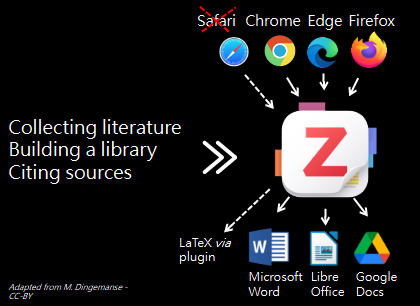

#### Note regarding Safari

Why is Safari crossed out? Zotero Connector for Safari is much more limited than the one for Firefox, Chrome or Edge. For example, it does not support advanced features such as **automatic proxy detection** and **automatic RIS/BibTeX import**.

![zotero][zotero] [Zotero knowledge base: Zotero Connector and Safari ](https://www.zotero.org/support/kb/safari_compatibility)

### Zotero is an open source software

Why does it matter?

* Users can contribute to the software - see ![zotero][zotero] [full list of Zotero plugins](https://www.zotero.org/support/https://www.zotero.org/support/plugins), and participate in the user community through the [Zotero Forum](https://forums.zotero.org/).
* Development is agile and user-oriented.
* Zotero is developed by a non-profit organization, with no financial interest in your data; you are not required to create an account to use Zotero.

![zotero][zotero] [Zotero website : Why Zotero?](https://www.zotero.org/why)

## 2. Installing and setting up Zotero

🚧 **If you had previously installed Zotero 6 and have not yet updated to Zotero 7, now is the time to do so.**

To do this, in the Zotero menu click on _Help_ > _Check for updates..._, and follow the instructions.

### Installing Zotero

![zotero][zotero] [Zotero website : Zotero download page](https://www.zotero.org/download/)

You need to install both **Zotero application** on your computer **AND** **Zotero Connector** in your browser (Chrome, Firefox or Edge).

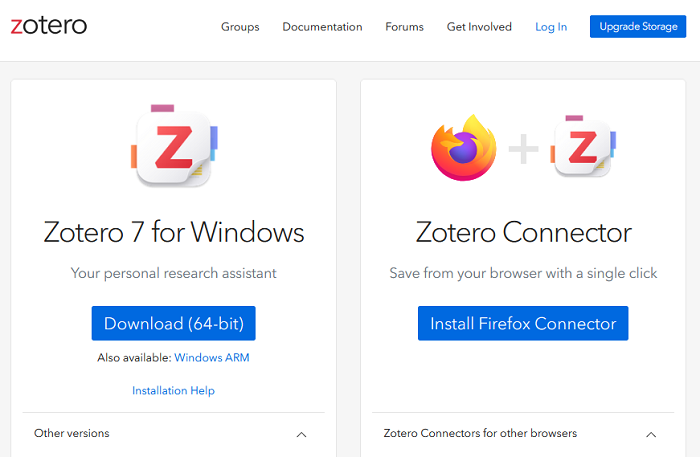

The steps may vary depending on your operating system, you will find detailed instructions in the documentation.

![zotero][zotero] [Zotero Documentation: Installation](https://www.zotero.org/support/installation)


### How to check if the installation worked?

To fully enjoy Zotero, the application should be plugged in your browser and in your word processor (Microsoft Word, LibreOffice Writer).

1. Check that Zotero is installed by opening the application on your computer.
2. Open your browser and check that Zotero appears in the toolbar. If it doesn't appear, follow the instructions given in the documentation.

![zotero][zotero] [Zotero documentation: Why is there no save button in my browser toolbar?](https://www.zotero.org/support/kb/no_toolbar_button)

4. Open your word processor and check that the Zotero plugin is installed. Usually, after installing Zotero, a new tab will appear in your word processor. Depending on your software, Zotero might alternatively be shown with other "Add-ons".

If the installation of the Word processor plugin did not work, you can reinstall it from Zotero itself.

1. Open Zotero.
2. Go to *Edit* > *Settings* (or *Zotero* > *Settings* on Mac OS).
3. Click on the *Cite* tab.
4. Scroll down to _Word Processors_.
5. At this stage, you can choose to install or reinstall one word processor plugin or more, according to the number you have on your computer.

![zotero][zotero] [Zotero Documentation: Word Processor Plugins](https://www.zotero.org/support/word_processor_integration)

![zotero][zotero] [Zotero Documentation: Preferences](https://www.zotero.org/support/preferences)

💬 _In Zotero 7 "Preferences" are now called "Settings". The documentation should soon be updated to take this change into account._

### Minimal settings

Here are a few recommendations to get started. All settings can be accessed from Zotero _Settings_.

#### "General" section

"File Handling section

  * Check the _Automatically attach associated PDFs and other files when saving items_ box, to automatically retrieve PDFs of articles when you are on a publisher's site or any other site where the PDF is present. If you are on PubMed, Scopus or another bibliographic database, you will need to follow the link to the publisher's site to save the bibliographic reference and the PDF of the article at the same time. And, of course, if it is a paying resource, your institution must be a subscriber.
  * Check the _Automatically retrieve metadata for PDFs and ebooks_ box.
  * Uncheck the _Automatically take snapshots when creating items from web pages_ box to avoid cluttering your library with snapshots of all the web pages from which you save documents.

#### "Sync" section

It is not necessary to create an online account or to enable synchronization to use Zotero. However, it is required for the following two features:

* **syncing** Zotero libraries on Zotero online server and on multiple devices (e.g. a work computer and a home computer),
* **groups** to create shared libraries.

We're going to use this group functionality with the group created for the course. To make this group library appear in Zotero, you need to set up Zotero synchronization. These settings can be accessed from _Settings_ > _Sync_. To get started, after entering your user name and password, use the following settings.

##### Data Syncing

Check _Sync automatically_.

##### File Syncing

* Uncheck _Sync attachment files in My Library using..._, unless you have checked this box previously and set the service to use for synchronizing your attachment files.
* Check _Sync attachment files in group libraries using Zotero storage_.

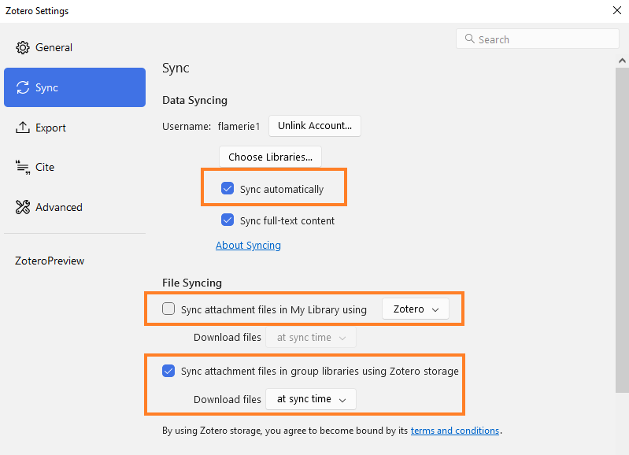

![zotero][zotero] [Zotero Documentation: Syncing](https://www.zotero.org/support/sync)

Once syncing has been enabled and an initial synchronisation has been performed, you should see a new "Group Libraries" section in Zotero, below "My Library".

In this section, you should see the group library you have just joined; you should find a collection (folder icon) with your Zotero username.

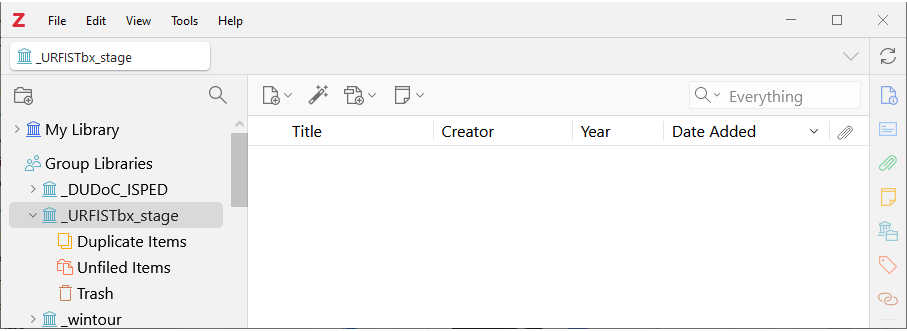

## 3. Building a Zotero library step 1, adding items and files

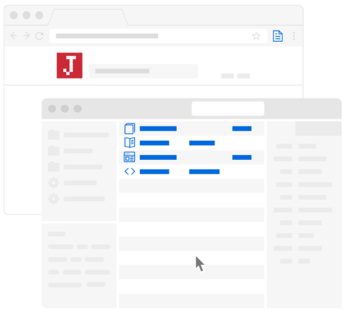

A bibliographic reference, an **item** in your Zotero library, is made up of **metadata**, descriptive details (title, authors, date, etc.) enabling you to retrieve it easily. Zotero structures the metadata you collect about items. When you cite with Zotero, it generates consistent citations and bibliographies. Zotero also lets you store files attached to items as **attachments**.

### Adding content via your web browser

This is the :

* **easiest**,
* **most reliable**,
* **most recommended**,

method to add documents to your library.

Zotero Connector is the plugin you have installed in your browser. This plugin detects the bibliographic references available on the web pages you visit.

Open Zotero and click on the _Save to Zotero_ button in your browser to save the bibliographic reference as an item in your Zotero library. Zotero will also try to save the full-text PDF file as an attachment at the same time.

Example : [an article from the journal Natures Sciences Sociétés](https://doi.org/10.1051/nss/2019025)

### Exercise "Saving document from online sites with Zotero Connector"

📝 As you browse the websites you usually use for your bibliographic research, save new items in the collection under your username in the course group library.

You can save books, journal articles, theses, or even web pages, newspaper articles or magazine articles. The key is to test saving in Zotero from your usual sources. Add files (pdf, jpg or other) if applicable.

### All methods for adding items to your library

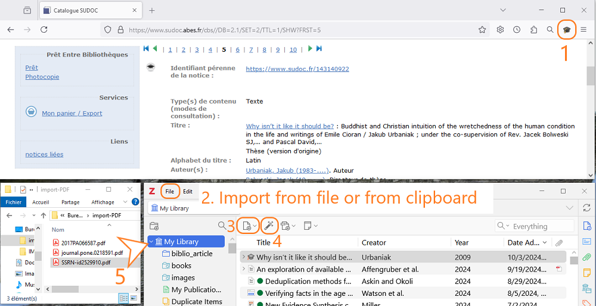


#### 1, Zotero Connector
This is the method we have just used.

#### 2, import from file or from clipboard

Some databases or catalogs can provide you with a downloadable file containing one or more references. The most common formats for these types of files are RIS (.ris) or BibTeX (.bib). This is particularly useful for large-scale exports or when moving from another reference manager.

💡 **On some sites, this export is better configured than saving through Zotero Connector.**

#### 4, with a unique identifier

With the magic wand, you add one or several items from their identifiers.

The following identifiers are supported:

* DOI,
* ISBN,
* PubMed identifier, the PMID,
* arXiv Id,
* bibcode ADS.

If you have an Excel file with the "ISBN" column correctly filled in, you can easily add a batch of books to your Zotero library.

#### 5, from PDFs

If you already have stored PDFs on your computer, it might be possible to retrieve the metadata afterwards.

⚠️ **This is not the recommended default method**. This feature is useful for processing a batch of PDFs you have in stock, but it should not be your usual method for adding content to your Zotero library.

To add a PDF to Zotero, just drag it from a folder and drop it into your library. Zotero automatically searches for metadata and automatically creates a parent item for the PDF file when possible. However, it might be that the PDF you added to your Zotero library is not recognized by Zotero. In this case, no metadata is retrieved. You must then add metadata using an identifier (DOI, ISBN, etc.) or manually, with the _Create Parent Item_ feature.

You can retrieve metadata for several PDFs at once.

Example : a PDF sent by a colleague

![zotero][zotero] [Zotero Documentation: Retrieve PDF metadata](https://www.zotero.org/support/retrieve_pdf_metadata)

#### 3, manually

Sometimes, there is no available metadata encoded in the web page you are visiting, or the document you are holding is not indexed in an online catalog. In these cases, you have to create or edit the item yourself.

In Zotero, you can create a new item by clicking on the _New Item_ toolbar button. You must choose the appropriate **document type** (_i. e._ "Book", "Report", etc.). When you have selected a document type, an empty item appears. You can then fill in the fields according to the document you have in front of you. In all cases, it is preferable to be exhaustive and to provide as much information as possible.

### Exercise "Other methods for adding items"

📝 Add documents using one of the following methods.

* **Magic wand**: use these DOIs

```
10.3389/FMARS.2017.00031
10.3389/fncir.2012.00077
10.3389/fnsys.2013.00014
10.3390/s17122757
10.3397/1.3702019
10.3724/SP.J.1118.2018.17252
10.3757/jser.49.Suppl-6_36
10.3758/BF03328608
10.3923/jeasci.2018.9380.9384
```

* **Manual entry**: an internal report, a presentation or any other item you would need to cite and you cannot find online.
* **From PDF**: use your own files or [the files in this folder](https://github.com/fflamerie/zotero_easy/tree/main/docs/import-PDF).

### Checking and editing items

Do not forget to check and edit the items you save in your library - it's all part of adding content!

Zotero offers smart features to make this easier and quicker than making every change entirely manually. For example :

* right-click on the content of a `Creator` field to invert the first and last names or fix case,
* right-click on the content of a `Title` field to transform the text and turn it into _Sentence Case_ or _Title case_,
* etc.

Whatever method you use to add items to your library, there may be typos to correct or information to add.

#### Recommendation 1: choose the right source

Give priority to reliable and exhaustive sources when creating or completing your items, _i.e._ :

* **publisher sites and bibliographic databases** for journal articles and book chapters (SpringerLink, Scopus, JStore, etc. // avoid Google Scholar),
* **library catalogues** for books (Babord+, Sudoc, WorldCat // avoid Amazon).

#### Recommendation 2: anticipate standards

Find out about the minimum requirements for citation writing in your field of research. Do you need to record the original date, place and commercial publisher for each book? If so, look them up and record them at the same time as you create the corresponding item in your Zotero library.

#### Recommendation 3: don't procrastinate

Make additions and changes straight away! As long as you have the document to hand and/or the information at your fingertips.

#### Resources

![zotero][zotero] [Zotero Documentation: Adding items](https://www.zotero.org/support/adding_items_to_zotero)


![zotero][zotero] [Zotero knowledge base: How do I use rich text formatting, like italics and sub/superscript, in titles?](https://www.zotero.org/support/kb/rich_text_bibliography)

![zotero][zotero] [Zotero knowledge base: Zotero Item Types and Fields > Citeable Fields not Included in Zotero](https://www.zotero.org/support/kb/item_types_and_fields#citeable_fields_not_included_in_zotero)

## 4. Building a Zotero library step 2, organizing content from bibliographic references to PDF annotations


Irrespective of the software used and the volume to be considered, here are the main desirable features for a personal library.

* It offers a wide range of search and browsing options.
* It includes complete and accurate metadata.
* It makes it easier to study and take notes.

### Tools for organizing your library

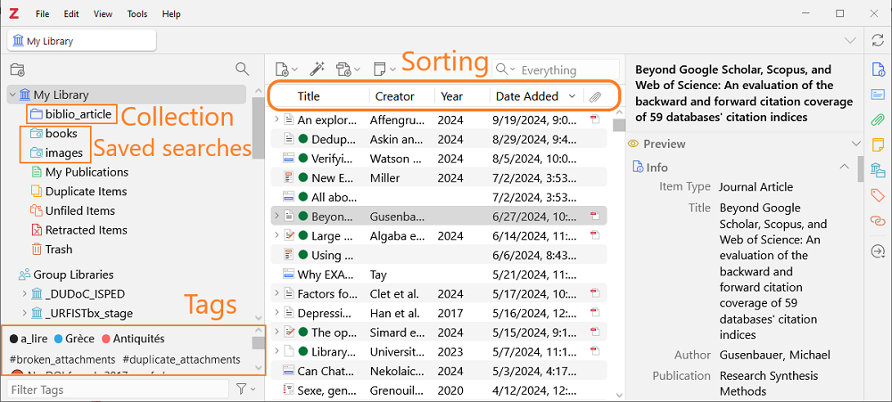

We will focus on some most useful features as you are starting your library, that is to say:

* tags,
* searches -> quick vs. advanced, immediate vs. saved with dynamic update,
* notes.

⚠️ In Zotero, the icon associated with a **collection** is a folder, but collections are more like **music playlists** (think of iTunes, Spotify, etc.) than folders in your computer filesystem.

### Getting started with organization

#### Tagging

* Create a tag **to_read**.
* Assign it a color.
* Add it to all the items in your library at once : how do you do this? 2 methods are possible.
* How many colored tags can you create?

#### Quick search and advanced search

* Quick search : what difference do you make between searching _All Fields & Tags_ and searching _Everything_?
* Create a saved search to retrieve all the articles tagged as **to_read** AND saved in your library within the last 7 days.

### To keep or not to keep automatic tags

By default, Zotero automatically records the keywords of the item in the database from which you saved it: author keywords in publisher sites and bibliographic databases, controlled indexing in bibliographic databases. All these heterogeneous words accumulated can end up producing a list of redundant terms (synonyms, variants of the same word) which is difficult to use, and which interferes with your personal tags.

You can disable this feature from _Settings_ > _General_ > _Miscellaneous > _Automatically tag items with keywords and subject headings_.

However, even if you uncheck this box you will still save the associated keywords when you add items via a **file import** and not via the browser. Unchecking this box does not disable the import of the _keywords_ field (or equivalent) recorded in a bibliographic file. There is therefore a good chance that you will still find automatic tags in your library. In addition, it is sometimes useful to refer to author keywords or controlled indexing in a database.

To keep a clean, easy-to-use list of personal tags separate from automatic tags, the best option is therefore to **prefix** your personal tags with a typographical sign such as the `_` underscore. This way, your personal tags will not only be easily identifiable, but will always be shown first in the tag selector.

### Why choose tags over collections?

There are three main reasons.

* **Readability**: with **coloured tags**, you can quickly view all items associated with a tag. You can also easily **filter** your tags in the tag selector. This allows you to create many tags without risk of getting confused.
* **Portability**: tags are part of the item's bibliographic information and are therefore exported in the same way as all other bibliographic information when you export items to a .ris, .csv, etc. file. Collections and saved searches, on the other hand, are part of your library's **interface**. Information about filing in a collection is not saved as a bibliographic detail for the item.
* **Automated management**: thanks to the scripts in [Actions & Tags plugin](https://github.com/windingwind/zotero-actions-tags), you can easily manage a large number of tags, split them, delete them globally or selectively, etc. With [Zutilo plugin](https://github.com/wshanks/Zutilo), you can copy all tags associated with an item and paste them into one or more other items.

### Saved searches to automate organisation

💡 **Let Zotero works for you**

Keep in mind that filing items in collections, adding tags, etc. requires manual input and takes time. **Saved searches** are a great way of saving time and improving efficiency, by automatically using the information you have retrieved and added for each item.

Saved searches support a relatively rich syntax. To retrieve all items for which a field is empty, for example items without an abstract, simply create a search on the following model.

```
Abstract -- does not contain -- %
```

### Zotero's built-in file reader and annotation tools

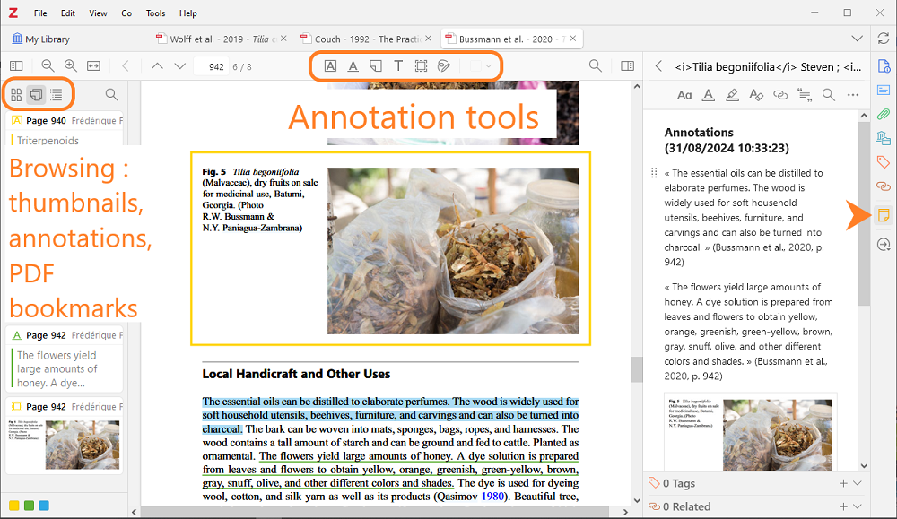

The **PDF reader** built in Zotero from Zotero 6 supports **EPUB** files and **webpage snapshots** since Zotero 7. In particular, it offers the following features, in combination with a powerful note editor.

* Open files in a built-in reader either within a tabbed interface in the main Zotero window, or in separate windows.
* Clean up metadata for an item while viewing the associated file.
* **Mark up** files using a variety of tools, including :
  * create text or ink annotations (PDF files only),
  * highlight and underline with 8 different colours,
  * extract text and images and comment on them.
* Systematically include **citation information**, including the page, in each annotation.
* **Add annotations to Zotero notes**: automatically create a note from all the annotations in a file, or add annotations from different files to a single note.
* **Cite from annotations**: the new "Add Note" button in the word processor plugin inserts the content of a Zotero note with active Zotero citations for automatically generating bibliographies.

#### Storing, importing and exporting annotations
Annotations created in Zotero's file reader cannot be read directly in an external PDF reader. They are not stored in the file but in your Zotero database.

Zotero can **import annotations** made in an external PDF reader, as ZotFile did.

To **export PDFs** with embedded annotations from Zotero, proceed as follows.

* Select the PDFs or their parent items in your Zotero library.
* In Zotero toolbar, select _File_ > _Export PDFs..._

### Resources

#### Resources for organizing your library

![zotero][zotero] [Zotero Documentation: Duplicate Detection](https://www.zotero.org/support/duplicate_detection)

![zotero][zotero] [Zotero Documentation: Collections and Tags](https://www.zotero.org/support/collections_and_tags)

![zotero][zotero] [Zotero Documentation: Searching](https://www.zotero.org/support/searching)

![zotero][zotero] [Zotero Documentation: Sorting](https://www.zotero.org/support/sorting)

![zotero][zotero] [Zotero Documentation: Notes](https://www.zotero.org/support/notes)

![zotero][zotero] [Zotero Documentation: Related Items](https://www.zotero.org/support/related_items)

#### Resources for annotating with Zotero

![zotero][zotero] [Zotero Documentation: The Zotero PDF Reader and Note Editor](https://www.zotero.org/support/pdf_reader)

![zotero][zotero] [Zotero knowledge base : Why does Zotero store PDF annotations in its database instead of in the PDF file?](https://www.zotero.org/support/kb/annotations_in_database)

## 5. Identifying and installing the standard citation styles for your field in Zotero


### Types of citation styles

A citation style defines the way in which the bibliographic parts of a text are organised and formatted. It prescribes which bibliographic information is displayed, in which order and how it is formatted (bold, italics, quotes, punctuation, indentation and spacing, etc.).

2 parts should be regarded.

* **Citations**: these can be inserted either as **in-text citations** (number, author's name and date, etc.), or as **note citations**, _i. e._ more or less abbreviated bibliographic entries in footnotes or endnotes.
* **Bibliography or list of cited references**.

[Zotero style repository](https://www.zotero.org/styles) contains over 10'000 styles, grouped into 2 main categories:

* **_in-text_** styles, in which a citation in the text refers to an entry in the final bibliography,
* **_note_** styles, in which a marker (symbol, number, etc.) points to a footnote or endnote.

#### Numeric _in-text_ styles

Numeric styles are the simplest and most unambiguous. In the text, a citation appears as a **number**. The same reference keeps the same number throughout the text.

>Yeast cells were grown at 25°C in batch cultures on 0.5% methanol for 36 hours <span style="color:#0000CD;">[21, 22]</span>.

In the bibliography, entries are listed following **the order of the citation numbers in the text**.

><span style="color:#0000CD;">21\.</span> Zwart KB, Veenhuis M, Harder W (1983) Significance of yeast peroxisomes in the metabolism of choline and ethanolamine. Antonie Van Leeuwenhoek 49: 369-385.
>
><span style="color:#0000CD;">22\.</span> van der Klei IJ, Harder W, Veenhuis M (1991) Methanol metabolism in a peroxisome-deficient mutant of Hansenula polymorpha: a physiological study. Arch Microbiol 156: 15-23.

##### Composite numeric _in-text_ styles
In composite numeric styles, a bibliographic entry may contain several references.
This type of style is **not supported by CSL**, the computer language in which Zotero citation styles are encoded.

In the text :

>Yeast cells were grown at 25°C in batch cultures on 0.5% methanol for 36 hours <span style="color:#0000CD;">(1)</span>

In the bibliography :

><span style="color:#0000CD;">1\. a)</span> Zwart KB, et al. (1983) Antonie van Leeuwenhoek 49: 369-385, <span style="color:#0000CD;">b)</span> van der Klei IJ, et al. (1991) Arch Microbiol 156: 15-23.

#### Author-date _in-text_ styles

Author-date styles are a little more complex than numeric styles, because the citation is made up of the name of one or more of the authors and the date. These styles therefore include **disambiguation** rules. These rules define how information is added to differentiate between citations which could be identical, but which refer to different items. For example, to differentiate two articles published in the same year with the same first author's name, a suffix may be added after the year : (Smith 2017a; Smith 2017b).

In the text, each citation is made of **the name of the author and the date of publication**.

> Yeast cells were grown at 25°C in batch cultures on 0.5% methanol for 36 hours <span style="color:#0000CD;">(van der Klei et al. 1991; Zwart et al. 1983)</span>
>
>Yeast cells were grown at 25°C in batch cultures on 0.5% methanol for 36 hours <span style="color:#0000CD;">(van der Klei et al.; Zwart et al.)</span></cite>

In the bibliography, entries are listed following **the alphabetical order by author**.

>van der Klei IJ, Harder W, Veenhuis M (1991) Methanol metabolism in a peroxisome-deficient mutant of Hansenula polymorpha: a physiological study. Arch Microbiol 156: 15-23.
>
>Zwart KB, Veenhuis M, Harder W (1983) Significance of yeast peroxisomes in the metabolism of choline and ethanolamine. Antonie Van Leeuwenhoek 49: 369-385.

#### Label _in-text_ styles

In the text, a citation is a **code**.

>Yeast cells were grown at 25°C in batch cultures on 0.5% methanol for 36 hours <span style="color:#0000CD;">[ZwVH1983; vaHV1991]</span>.</cite>

In the bibliography, entries are listed following **in order of appearance in the text**.

><span style="color:#0000CD;">[ZwVH1983]</span> Zwart KB, Veenhuis M, Harder W (1983) Significance of yeast peroxisomes in the metabolism of choline and ethanolamine. Antonie Van Leeuwenhoek 49: 369-385.
>
><span style="color:#0000CD;">[vaHV1991]</span> van der Klei IJ, Harder W, Veenhuis M (1991) Methanol metabolism in a peroxisome-deficient mutant of Hansenula polymorpha: a physiological study. Arch Microbiol 156: 15-23.

Only one style follows to this model in the style repository, it is [DIN 1505-2 (alphanumeric, German)](https://www.zotero.org/styles/din-1505-2-alphanumeric) style.
It has 2 limitations:

* it is monolingual in German,
* the label construction scheme cannot be modified.

A custom label can be defined, but this will have to be done manually for each reference.

* For each item, the label must be recorded in the Extra field of the Zotero record, in the form: `citation-label: label_value`.
* As a result, labels that are identical but refer to different articles (same first author and same year) will have to be **disambiguated** manually.

#### _Note_ styles

Styles with notes, mostly used in the arts and humanities, are the most complex. Citations are not codes inserted into the text, but bibliographic entries in a more or less abbreviated form, inserted as footnotes or endnotes. In addition, Latin terms such as _ibidem_, _op. cit._, etc. are sometimes used, according to precise substitution rules.

You will find a marker in the text, and the contents of the note at the bottom of the page or at the end of the document.

>"In the Island of St. Kilda, according to Martin, <span style="color:#0000CD;">[*]</span> the men do not acquire beards until the age of thirty or upwards, and even then the beards are very thin. “
>
><span style="color:#0000CD;">[*]</span>'Voyage to St. Kilda' (3rd edit. 1753), p. 37.

In the bibliography, entries are generally listed in **alphabetical order by author**. Note that some note styles do not include a list of the cited references.

The marker format must be set in the **word processor**.

**Example in LibreOffice (in French)**


### How do you choose a citation style when none is required?

The following decision criteria can be taken into account.

#### Decision criterion 1, existence of a standard model

Is there a standard or frequently used style in your field? For example, "Vancouver" and "American Psychological Association" in health sciences, "Modern Language Association" in certain areas of literature, "IEEE" in engineering sciences, etc.

#### Decision criterion 2, document types supported
Are you citing many different document types? Not all styles support all document types. The _Nature_ style, for example, will not be the most suitable if you are citing unpublished documents such as theses. _Nature_ asks authors to cite a limited number of document types (see [Instructions for Authors](http://www.nature.com/nature/for-authors/formatting-guide), _References section_), so Zotero CSL style for _Nature_ encodes citation formatting for these document types only.

#### Decision criterion 3, drafting language
Do you write only in one language? In different languages depending on the case? While some styles are language agnostic, others have a predefined language that cannot be changed. For example, the _Nature_ style is only set up for English, according to the British standard.

All styles localised for a language other than English include the name of that language in their title. For example, searching for "français" in Zotero style repository will only display styles localised in French, "deutsch" will only display styles localised in German, etc. Styles without a language are either localised in English or language agnostic.

Limiting a style to a specific language prevents users from making mistakes. Whatever the user's default language, they will not be able to write the bibliographic parts of their text in an other language than the one prescribed by the citation style. A journal that publishes articles in a single language can thus prevent language errors by localising its citation style. In addition, this makes it possible to define punctuation precisely and rigorously and to ensure scrupulous compliance with the rules of typography (for example, unbreakable space  to be inserted before the semicolon in French).

#### Comparing styles easily in Zotero

Two tools make it easy to compare citation styles in Zotero.

* The **Style Preview feature** can be accessed from Settings > Cite.

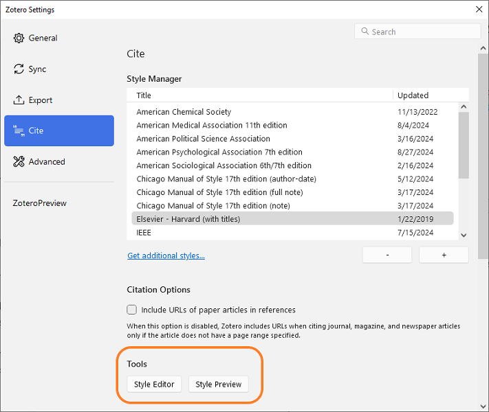
  
* A bibliographic entry from the urrently selected item in the library can be displayed in the **header of the right-hand panel**.

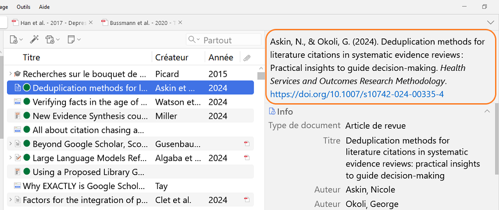

In Style Preview, Zotero generates citations and the corresponding bibliography **in different styles**, based on a **selection of items**. While this allows you to compare the formatting of several styles for different types of documents at a glance, it takes several clicks to generate the preview, which can be difficult to read if you have installed a large number of styles.

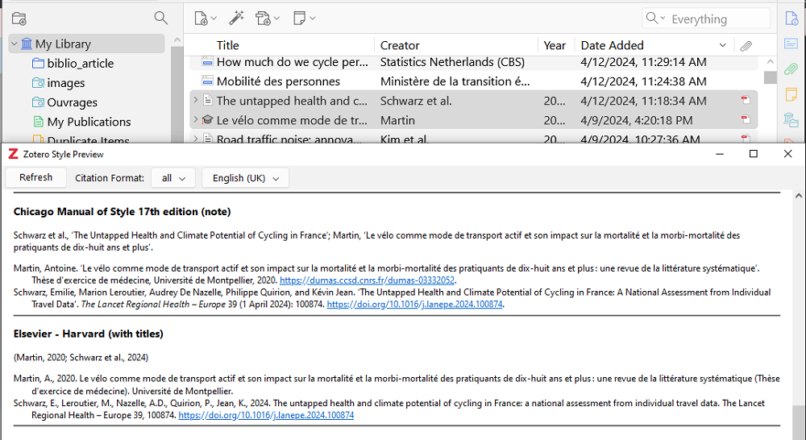

The header of the right-hand panel allows you to quickly view the formatting applied **by a specific style** to **a specific item**. It also allows you to check that the bibliographic information is being entered correctly as you go along, as it immediately highlights any input errors that affect the bibliographic entry being created. However, the header only displays the bibliography entry and not the **citation**, which may be an important element to consider, particularly for note styles.

##### Points to watch out for

Whatever the tool and method used to compare styles, it is important to make sure of two points if the comparison is to be meaningful.

First of all, make sure that the items you use as examples reflect the **diversity of document types** you cite (article, chapter, but also thesis, patent or film): this will ensure that all these types are taken into account by the styles you are comparing.

Next, and most importantly, make sure that these items are complete and accurate in your Zotero library.

* **If bibliographic information is missing**, it is logical that the style cannot display it when it generates the citations and bibliography.
* **If you make inadequate or inappropriate use of certain fields**, you will also generate an inappropriate or inadequate bibliography, that does not match with the expected result.

### Resources

![zotero][zotero] [Zotero Documentation: Citation styles](https://www.zotero.org/support/styles)

![zotero][zotero] [Zotero Documentation: Preferences > Cite](https://www.zotero.org/support/preferences/cite)

![zotero][zotero] [Zotero Documentation: Editing CSL Styles - Step-by-Step Guide](https://www.zotero.org/support/dev/citation_styles/style_editing_step-by-step)

## 6. Citing with Zotero

Of course, you can apply citation rules by hand, but Zotero will be faster and more consistent. Here's what Zotero will do :

* count authors and display _et al._ when needed;
* calculate, generate and update accurate in-text citations, whether numeric or author-date;
* include all the references you have cited in your text in the bibliography;
* sort this bibliography according to the requirements of the citation style;
* handle and fix punctuation, capitalization, indentation;
* _and much more..._

It saves you these repetitive tasks so that you can concentrate on what it does not support:

* the selection of documents to be cited,
* the completeness and accuracy of the bibliographical information to be provided.

Zotero also does the following.

* Insert correctly formatted bibliographic references into any document (email, .pptx file, etc.) by a simple drag and drop: this is **Quick Copy**.
* Create independent bibliographies in different formats (.html, .rtf): this is the contextual menu _Create a bibliography from selected documents..._
* Create dynamic and collaborative bibliographies online, using shared private or public libraries: this is one of the features of Zotero **groups**.

Zotero is also compatible with other writing softwares and services (such as Overleaf or Authorea).

Using LaTex or services relying on a BibTeX file ? Install [Better BibTeX (BBT) - plugin](https://retorque.re/zotero-better-bibtex/).

### Exercise "Citing with Zotero"

📝 The aim is to reproduce exactly the result shown in the PDF template file available from [the "Citing with Zotero" exercise section](https://github.com/fflamerie/zotero_easy#exercise-citing-with-zotero).

The citation style used is **American Psychological Association 7th edition**.

### Resources

![zotero][zotero] [Zotero Documentation: Word processor integration](https://www.zotero.org/support/word_processor_integration)

![zotero][zotero] [Zotero Documentation: Creating bibliographies](https://www.zotero.org/support/creating_bibliographies)

## 7. From Zotero library to online bibliography
### Zotero groups

**Zotero groups** are a simple way of sharing bibliographies, whether you want to work collaboratively and privately with other people, and/or distribute bibliographic selections to a wider or narrower audience.

You can choose to make your personal Zotero library public, which will mean that anyone can consult your bibliographic references. This setting does not affect the **attached files**, which remain accessible only to you.

However, the Zotero group is a much better option if you want to share your bibliography.

First, a Zotero group is a **separate space** from your personal library: when you add an item from your personal library to a group library, it is copied from your library to the group library. If you modify this item in your personal library, the changes are not reflected in the group library, and vice versa. In this way, you can clearly separate your personal bibliographic work from a shared bibliographic work. It is of course possible to save an item directly in the group library, without going through your personal library.

In a Zotero group, you can define very precisely who has the right to read or edit the group library, using a combination of the following settings.

* The **type of group**: private, public with restricted participation or public with open participation.
* **Group members**: role as member, administrator or owner.
* The **rights granted to the library**: reading the library, editing the library, editying files, etc.

### Points to remember about synchronisation and groups

* The **300 MB quota** of free storage on the Zotero server is for **attached files** and not bibliographic data: if you do not synchronise your attached files, you will not exceed your storage. For group libraries, storage is counted on the **group owner's quota**.
* The online account allows you to **save items directly to your online library**. You can add items to your Zotero library even if Zotero is not installed on the computer you are using. However, you do need to have Zotero Connector installed in your browser, or to use the magic wand to add by identifier.
* In your online library, you will find some of the features of your local library. Note that the local application is essential for **word processor integrations**.
* Although the right to read the group library may be granted to everybody, **this access is limited to bibliographic data**: attached files remain accessible only to group members.
* Make sure **you assign rights correctly**. For example, if the rights of group members are limited to reading the library, don't forget to give administrator rights to all the members who need to edit the library.
* A Zotero group does not necessarily involve several contributors. You can be the only contributor to a group whose library can be consulted by everyone, or you can create a group simply to have a library separate from your personal library.
* An **RSS feed** displayed on the group's online library page allows you to track additions to the library. To do this, the group must be public, and its library must be accessible to everyone.

### Resources

![zotero][zotero] [Zotero Documentation: Zotero groups](https://www.zotero.org/support/groups)

![zotero][zotero] [Zotero Documentation: Synchronisation](https://www.zotero.org/support/sync)

![zotero][zotero] [Zotero knowledge base: Is the Zotero web library the same as the Zotero desktop app?](https://www.zotero.org/support/kb/web_vs_desktop/)

## 8. Your Zotero data

![zotero][zotero] [Zotero Documentation: The Zotero Data Directory](https://www.zotero.org/support/zotero_data)


⚠️ 2 points to watch out for.

* Make sure that the Zotero data directory is part of the data you **back up** automatically and regularly.
* Make sure that your data directory is not located in a location identified as **unsafe**

![zotero][zotero] [Zotero Documentation: Preferences > Advanced > Unsafe Data Directory Locations
](https://www.zotero.org/support/preferences/advanced)

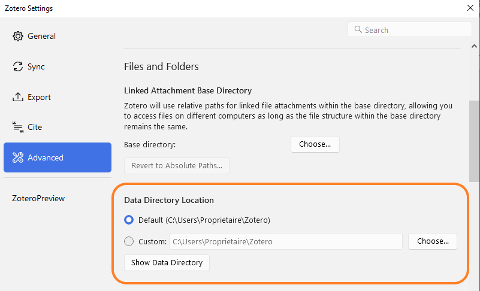

## 9. Conclusion

### Any questions?

* Read the [documentation](https://www.zotero.org/support)! It is exhaustive and detailed.
* Are you facing issues? You're probably not the first nor the only one, so check out the forum and create a new discussion if you need to: [Zotero Forum](https://forums.zotero.org/).

![zotero][zotero] [Zotero Documentation: Getting help](https://www.zotero.org/support/getting_help)

### Going further
We've covered Zotero's main features, but Zotero can do much more to become your personal research assistant.

In the Zotero documentation, ![zotero][zotero] [the "Getting the most out of Zotero" section](https://www.zotero.org/support) is a good starting point for exploring all the software's potential.

#### Set up Library Lookup

In this section "Getting the most out of Zotero", setting your institution's link resolver will save you time and make it easier to locate and access full text.

In the _Settings_ > _General_ section, under _Locate_, open the _Resolver_ drop-down menu and navigate the geographical list to select your organisation.

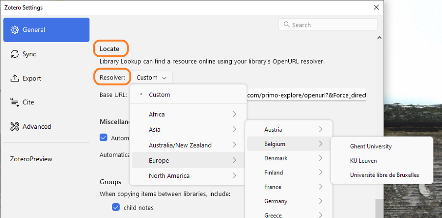

This will lead you to all the access options available in your institution, and you will be able to find PDFs that Zotero was unable to download automatically.

All you have to do is click on _Library Lookup_ in the _Locate_ menu, i.e. the arrow with a circle at the bottom of the shortcut bar on the right-hand pane.

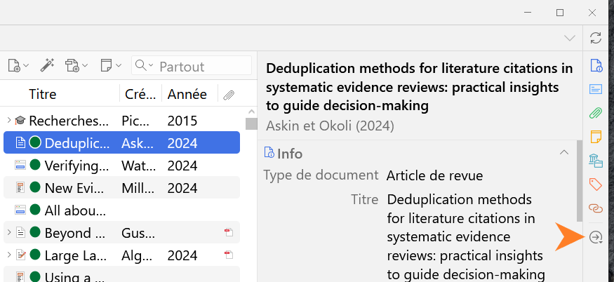

![zotero][zotero] [Zotero Documentation : Locate Menu](https://www.zotero.org/support/locate)

[zotero]: img/icone_zotero.png

# Credits

<a rel="license" href="http://creativecommons.org/licenses/by-sa/3.0/fr/"></a><br />This content is made available under the licence  Creative Commons CC BY-SA 4.0 Deed <a rel="license" href="https://creativecommons.org/licenses/by-sa/4.0/deed.en">Attribution-ShareAlike 4.0 International</a>.

**Author**

Frédérique Flamerie

**Visual graphics**

[Zotero website](https://www.zotero.org)
