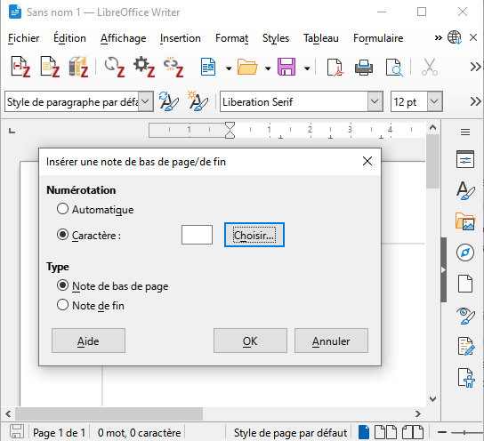

# Reference management made easy with Zotero

The icon ![zotero][zotero] points to the official Zotero documentation, including Zotero forums : it is the best source for more information and some help !

## Learning objectives

* Create and organize a library of bibliographic references and PDF with Zotero
* Cite with Zotero word processor plugins, applying the standards of your field
* Understand Zotero’s environment to optimize and increase its usage

## Agenda

- [1. Introduction](#1-introduction)   
- [2. Installing and setting up Zotero](#2-installing-and-setting-up-zotero)   
- [3. Building a Zotero library step 1, adding items and files](#3-building-a-zotero-library-step-1-adding-items-and-files)   
- [4. Building a Zotero library step 2, organizing content from bibliographic references to PDF annotations](#4-building-a-zotero-library-step-2-organizing-content-from-bibliographic-references-to-PDF-annotations)
- [5. Identifying and installing the standard bibliographic styles for your field in Zotero](#5-identifying-and-installing-the-standard-bibliographic-styles-for-your-field-in-Zotero)  
- [6. Citing with Zotero](#6-citing-with-zotero)   
- [7. From Zotero library to online bibliography](#7-from-zotero-library-to-online-bibliography)
- [8. Your Zotero data](#8-your-zotero-data)
- [9. Conclusion](#9-conclusion)

## 0. Round table introduction

1. Which university or organisation do you belong to? What is your area of research?
2. What are your expectations for the course?

## 1. Introduction

### Overview

Zotero is a **reference manager**. When you use a reference manager, the following tasks are (more or less) a 1-click process:

* add/import bibliographic references,
* create a bibliography,
* cite while you write a paper.

All these technical tasks are carried out by the software, but remember that **you are the brain**. This means that you should:

* check that the reference data are correct and complete,
* sort and organize your references,
* select relevant references to cite.

Zotero solves the following problems that can be encountered when doing bibliography without software (the list is not exhaustive).

* Heaps of PDFs with inscrutable file names
* No links between bibliographic references, files, notes
* When citing, copy+paste best option
* Pointless reformatting of references
* Collaboration difficult to organize


#### Note regarding Safari

Why is Safari crossed out? The Zotero connector for Safari is much more limited than the one for Firefox, Chrome or Edge. For example, it does not support advanced features such as **automatic proxy detection** and **automatic RIS/BibTeX import**.

![zotero][zotero] [Zotero knowledge base: Zotero Connector and Safari ](https://www.zotero.org/support/kb/safari_compatibility)


### Zotero is an open source software

Why does it matter?

* Users can contribute to the software - see [full list of Zotero add-ons](https://www.zotero.org/support/https://www.zotero.org/support/plugins), and participate in the user community through the [Zotero Forum](https://forums.zotero.org/).
* Development is agile and user-oriented.
* Zotero is developed by a non-profit organization, with no financial interest in your data; you are not required to create an account to use Zotero.

![zotero][zotero] [Zotero website : Why Zotero?](https://www.zotero.org/why)

## 2. Installing and setting up Zotero

🚧 **If you have previously installed Zotero 6 and have not yet updated to Zotero 7, now is the time to do so.**

To do this, in the Zotero menu click on _Help_ > _Check for updates..._, then follow the instructions that appear one after the other.

### Installing and setting up Zotero

![zotero][zotero] [Zotero website : Zotero download page](https://www.zotero.org/download/)

You need to install both the Zotero **application** AND the Zotero **connector** for your browser (Chrome, Firefox or Edge).


The steps may vary depending on your operating system, you will find detailed instructions in the documentation.

![zotero][zotero] [Zotero Documentation: Installation](https://www.zotero.org/support/installation)


### How to check if the installation worked?

To fully enjoy Zotero, the software should be plugged in your browser and your word processor (Microsoft Word, LibreOffice Writer).

1. Check that Zotero is installed by opening the application on your computer.
2. Open your browser and check that Zotero appears in the toolbar. If it doesn't appear, follow the instructions given on the dedicated page in [Zotero documentation: Why is there no save button in my browser toolbar?](https://www.zotero.org/support/kb/no_toolbar_button).
3. Open your word processor and check that the Zotero plugin is installed. Usually, after installing Zotero, a new tab will appear in your word processor. Depending on your software, Zotero might alternatively be shown with other "Add-ons".

If the installation of the Word processor plugin did not work, you can reinstall it from Zotero itself.

1. Open Zotero
2. Go to *Edit > Settings* (or *Zotero > Settings* on Mac OS)
3. Click on the *Cite* tab
4. Scroll down to _Word Processors_
5. At this stage, you can choose to install or reinstall one word processor plugin or more, according to the number you have on your computer.

![zotero][zotero] [Zotero Documentation: Word Processor Plugins](https://www.zotero.org/support/word_processor_integration)

![zotero][zotero] [Zotero Documentation: Preferences](https://www.zotero.org/support/preferences)

💬 _In Zotero 7 the "Preferences" are now called "Settings". The documentation should soon be updated to take this change into account._

### Minimal setting-up of the preferences

Here are a few recommendations to get started. All settings can be accessed from Zotero _Settings_.

#### "General" section

File management section

  * Check the _Automatically attach associated PDFs and other files when saving items_ box, to automatically retrieve PDFs of articles when you are on a publisher's site or any other site where the PDF is present. If you are on PubMed, Scopus or another bibliographic database, you will need to follow the link to the publisher's site to save the bibliographic reference and the PDF of the article at the same time. And, of course, if it is a paying resource, your institution must be a subscriber.
  * Check the _Automatically retrieve metadata for PDFs and ebooks_ box.
  * Uncheck the _Automatically take snapshots when creating items from web pages_ box to avoid cluttering your library with captures of all the web pages from which you save documents in your Zotero library.

#### "Sync" section

It is not necessary to create an online account or to enable synchronization to use Zotero. However, it is required for the following two features:

* **syncing** Zotero libraries on the Zotero online server and on multiple devices (e.g. a work computer and a home computer),
* **groups** to create shared libraries.

We're going to use this group functionality by using the group library created for the course.

To make this group library appear in Zotero,you need to set up Zotero synchronization.

These settings can be accessed from _Settings_ > _Sync_.

To get started, after entering your user name and password, we will use the following settings.

##### Data Syncing

Check _Sync automatically_.

##### File Syncing

* Uncheck _Sync attachment files in My Library using..._, unless you have checked this box yourself and set the service to use for synchronizing your attachments.
* Check _Sync attachment files in group libraries using Zotero storage_.


![zotero][zotero] [Zotero Documentation: Syncing](https://www.zotero.org/support/sync)

Once syncing is enabled, you should see a new "Group Libraries" section in Zotero, below "My Library".

In this section, you should see the group library you have just joined; you should find a collection (folder icon) with your Zotero username.


## 3. Building a Zotero library step 1, adding items and files


A bibliographic reference, an **item** in your Zotero library, is made up of **metadata**, information describing an article, a book, etc. and enabling you to find it easily at a later date. Zotero structures the metadata you collect about documents. When you cite with Zotero, it generates consistent citations and bibliographies. Zotero also lets you store files attached to references in the form of **attachments**.

### Adding content via your web browser

This is the :

* **easiest**,
* **most reliable**,
* **most recommended**,

method to add documents to your library.

The Zotero Connector is the extension you have installed in your browser. This extension detects the bibliographic references available on the web pages you visit.

Open Zotero and click on the _Save to Zotero_ button in your browser to save the bibliographic reference as an item in your Zotero library. Zotero will also try to save the full-text PDF file as an attachment at the same time.

Example : [an article from the journal Natures Sciences Sociétés](https://doi.org/10.1051/nss/2019025)

### Exercise "Saving document from online sites with the Zotero Connector"

We will take **10 minutes** for this exercise.

As you browse the websites you usually use for your bibliographic research, save new items in the collection under your name in the course group library.

You can save books, journal articles, theses, or even web pages, newspaper articles or magazine articles. The key is to test saving in Zotero from your usual sources. Add files (pdf, jpg or other) if applicable.

### All methods to add items to your library


#### 1, the Zotero Connector
This is the method we have just used.

#### 2, import from file or from clipboard

Some databases or catalogs can provide you with a downloadable file containing one or more references. The most common formats for this types of files are RIS (.ris) or BibTeX (.bib). This is particularly useful for large-scale exports or when changing bibliographic management software.

💡 **On some sites, this export is better configured than saving through the Zotero connector.**

#### 4, with a unique identifier

The magic wand is used to add a document or a batch of documents using their identifier.

The following identifiers are supported:

* DOI,
* ISBN,
* PubMed identifier, the PMID,
* arXiv Id,
* bibcode ADS.

If you have an Excel file with the "ISBN" column correctly filled in, you can easily add a batch of books to your Zotero library.

#### 5, from PDFs

If you already have stored PDFs on your computer, it might be possible to retrieve the metadata afterwards.

⚠️ **This is not the recommended default method**. This feature is useful for processing a batch of PDFs you have in stock, but it should not be your usual method of adding content to your Zotero library.

To add a PDF to Zotero, just drag it from a folder and drop it into your library. Zotero automatically searches for metadata and automatically creates an item attached to the PDF file when possible. However, it might be that the PDF you added to your Zotero library is not recognized by Zotero. In this case, no metadata is retrieved. You must then add metadata using an identifier (DOI, ISBN, etc.) or manually, using _Create Parent Item_ feature.

You can retrieve metadata for several PDFs at the same time.

Example : a PDF sent by a colleague

![zotero][zotero] [Zotero Documentation: Retrieve PDF metadata](https://www.zotero.org/support/retrieve_pdf_metadata)

#### 3, manually

Sometimes, there is no available metadata encoded in the webpage you are visiting or the document you are holding is not indexed in an online catalog. In these cases, you have to create or edit the reference yourself.

In Zotero, you can create a new item by clicking on the _New Document_ button on the toolbar. You must choose **the document type** for which you wish to create a document(_i. e._ "Book", "Report", etc.). When you select document type, an empty item appears. You can then fill in the fields according to the document you have in front of you. In all cases, it is preferable to be exhaustive and to provide as much information as possible.


### Exercise "Other methods for adding items"

We will take **10 minutes** for this exercise.

Add docuemnts using one of the following methods.

* **Magic wand**: use these DOIs

```
10.3389/FMARS.2017.00031
10.3389/fncir.2012.00077
10.3389/fnsys.2013.00014
10.3390/s17122757
10.3397/1.3702019
10.3724/SP.J.1118.2018.17252
10.3757/jser.49.Suppl-6_36
10.3758/BF03328608
10.3923/jeasci.2018.9380.9384
```

* **Manual entry**: an internal report, a presentation or any other item you would need to cite and you cannot find online.
* **From PDF**: use your own files or [the files in this folder](https://github.com/fflamerie/zotero_gerer_biblio/blob/master/content/import-PDF).

### Checking and editing items

Do not forget to check and edit the items you save in your library - it's all part of adding content!

Zotero offers smart features to make this easier and quicker than making every change entirely manually. For example :

* right-click on the content of a `Creator` field to invert the first and last names or fix case,
* right-click on the content of a `Title` field to transform the text and turn it into _Sentence Case_ or _Title case_,
* etc.

Whatever method you use to add documents to your library, there may be typos to correct or information to add.

#### Recommendation 1: choose the right source

Give priority to reliable and exhaustive sources when creating or completing your documents, i.e. :

* **publisher sites and bibliographic databases** for journal articles and book chapters (SpringerLink, Scopus, JStore, etc. // avoid Google Scholar),
* **library catalogues** for books (Babord+, Sudoc, WorldCat // avoid Amazon).

#### Recommendation 2: anticipate standards

Find out about the minimum requirements for bibliographic writing in your field of research. Do you need to record the original date, place and commercial publisher for each book? If so, look them up and record them at the same time as you create the corresponding item in your Zotero library.

#### Recommendation 3: don't procrastinate

Make additions and changes straight away! As long as you have the document to hand and/or the information at your fingertips.

#### Resources

![zotero][zotero] [Zotero Documentation: Adding items](https://www.zotero.org/support/adding_items_to_zotero)


![zotero][zotero] [Zotero knowledge base: How do I use rich text formatting, like italics and sub/superscript, in titles?](https://www.zotero.org/support/kb/rich_text_bibliography)

![zotero][zotero] [Zotero knowledge base: Zotero Item Types and Fields > Citeable Fields not Included in Zotero](https://www.zotero.org/support/kb/item_types_and_fields#citeable_fields_not_included_in_zotero)

## 4. Building a Zotero library step 2, organizing content from bibliographic references to PDF annotations


Irrespective of the software used and the volume to be considered, here are the main desirable features for a personal library.

* It offers a wide range of search and navigation options.
* It includes complete and accurate metadata.
* It makes it easier to study and take notes.

### Tools for organizing your library


We will focus on some most useful features as you are starting your library, that is to say:

* tags,
* searches -> quick vs. advanced, immediate vs. saved with dynamic update,
* notes.

⚠️ In Zotero, the icon associated with a **collection** is a folder, but collections are more like **music playlists** (think of iTunes, Spotify, etc.) than folders in your computer filesystem.

### Exercise "Getting started with organization"

We take **5 minutes** for this exercise.

#### Tagging

* Create a tag **to_read**
* Assign it a color
* Add it to all the items in your library at once : how do you do this? 2 methods are possible
* How many colored tags can you create?

#### Searching

* Quick search : what difference do you make between searching _All Fields & Tags_ and searching _Everything_?
* Create a saved search to retrieve all the articles tagged as **to_read** AND saved in your library within the last 7 days.

### To keep or not to keep automatic tags

By default, Zotero automatically saves the keywords associated with the item in the database from which you saved it: Rameau indexing in Sudoc, author keywords in publisher sites and bibliographic databases, controlled indexing in bibliographic databases. All these heterogeneous terms accumulated can end up producing a list of redundant terms (synonyms, variants of the same word) which is difficult to use, and which interferes with your list of personal tags.

You can disable this feature from _Settings_ > _General_ > _Miscellaneous > _Automatically tag items with keywords and subject headings_.

Note, however, that even if you uncheck this box you will still save the associated keywords when you add items via a **file import** and not via the browser. Unchecking this box does not disable the import of the _keywords_ field (or equivalent) recorded in a bibliographic file. There is therefore a good chance that you will still find automatic tags in your library. In addition, it is sometimes useful to refer to author keywords or controlled indexing in a database.

To keep a clean, easy-to-use list of personal tags separate from automatic tags, the best option is therefore to **prefix** your personal tags with a typographical sign such as the `_` underscore. This way, your personal tags will not only be easily identifiable, but will always be shown first in the tag selector.

### Saved searches to automate organisation

💡 **Let Zotero works for you**

Keep in mind that filing items in collections, adding tags, etc. requires manual input and takes time. **Saved searches** are a great way of saving time and improving efficiency, by automatically using the information you have retrieved and added for each item.

Saved searches support a relatively rich syntax.
To retrieve all references for which a field is empty, for example references without an abstract, simply create a search on the following model.

```
Abstract -- does not contain -- %
```

### Zotero's integrated file reader and annotation tools


The **PDF reader** integrated from Zotero 6 supports **EPUB** files and **webpage snapshots** since Zotero 7. In particular, it offers the following features. Note that these features are combined with those of a powerful note editor.

* Open files in a built-in reader either within the main Zotero window, in a tabbed interface, or in separate windows.
* Clean up metadata for an item while viewing the associated file.
* **Mark up** files using a variety of tools, including :
  * create text or handwritten annotations (PDF files only),
  * highlight and underline with 8 different colours,
  * extract text and images and comment on them.
* Systematically include **citation information**, including the page, in each annotation.
* **Add annotations to Zotero notes**: automatically create a note from all the annotations in a file, or add annotations from different files to a single note.
* **Cite from annotations**: the new "Add Note" button in the word processing plugin inserts the content of a Zotero note with active Zotero citations for automatically generating bibliographies.

#### Storing, importing and exporting annotations
Annotations created in Zotero's file reader cannot be read directly in an external PDF reader. They are not stored in the file but in your Zotero database.

Zotero can **import annotations** made in an external PDF reader, as ZotFile did.

To **export PDFs** with embedded annotations from Zotero, proceed as follows.
* Select the PDF parent documents in your Zotero library.
* In the Zotero menu bar, select _File_ > _Export PDF..._

### Resources

#### Resources for organizing your library

![zotero][zotero] [Zotero Documentation: Duplicate Detection](https://www.zotero.org/support/duplicate_detection)

![zotero][zotero] [Zotero Documentation: Collections and Tags](https://www.zotero.org/support/collections_and_tags)

![zotero][zotero] [Zotero Documentation: Searching](https://www.zotero.org/support/searching)

![zotero][zotero] [Zotero Documentation: Sorting](https://www.zotero.org/support/sorting)

![zotero][zotero] [Zotero Documentation: Notes](https://www.zotero.org/support/notes)

![zotero][zotero] [Zotero Documentation: Related Items](https://www.zotero.org/support/related_items)

#### Resources for annotating with Zotero

![zotero][zotero] [Zotero Documentation: The Zotero PDF Reader and Note Editor](https://www.zotero.org/support/pdf_reader)

![zotero][zotero] [Zotero knowledge base : Why does Zotero store PDF annotations in its database instead of in the PDF file?](https://www.zotero.org/support/kb/annotations_in_database)

## 5. Identifying and installing the standard bibliographic styles for your field in Zotero


### Types of citation styles

A citation style defines the way in which the bibliographic elements of a document are organised and formatted. It is the style which prescribes which bibliographic information is displayed, in which order and how it is formatted (bold, italics, quotes, punctuation, indentation and spacing, etc.).

2 parts should be regarded.

* **Citions**: these can be inserted either as **in-text citations** (number, author's name and date, etc.), or as **note citations**, i. e. more or less abreviated bibliographic entries in footnotes or endnotes.
* **Bibliography or list of references cited**.

There are different types of citation style, corresponding to different Zotero style formats. The [Zotero style repository](https://www.zotero.org/styles) contains over 10,000 styles, grouped into 2 main categories:

* **_in-text_** styles, in which a citation in the text refers to an entry in the bibliography,
* **_note_** styles, in which a marker (symbol, number, etc.) points to a footnote or endnote.

#### Numeric _in-text_ styles

Numeric styles are the simplest and most unambiguous. In the text, each reference cited is called by a **number**. The same reference keeps the same number throughout the text.

>Yeast cells were grown at 25°C in batch cultures on 0.5% methanol for 36 hours <span style="color:#0000CD;">[21, 22]</span>.

In the bibliography, references are listed following **the order in which they appear in the text**.

><span style="color:#0000CD;">21\.</span> Zwart KB, Veenhuis M, Harder W (1983) Significance of yeast peroxisomes in the metabolism of choline and ethanolamine. Antonie Van Leeuwenhoek 49: 369-385.
>
><span style="color:#0000CD;">22\.</span> van der Klei IJ, Harder W, Veenhuis M (1991) Methanol metabolism in a peroxisome-deficient mutant of Hansenula polymorpha: a physiological study. Arch Microbiol 156: 15-23.

##### Composite numeric _in-text_ styles
In composite numeric styles, a bibliographic entry may contain several references.
This type of style is **not supported by CSL**, the computer language in which the bibliographic styles used by Zotero are encoded.

In the text :

>Yeast cells were grown at 25°C in batch cultures on 0.5% methanol for 36 hours <span style="color:#0000CD;">(1)</span>

In the bibliography :

><span style="color:#0000CD;">1\. a)</span> Zwart KB, et al. (1983) Antonie van Leeuwenhoek 49: 369-385, <span style="color:#0000CD;">b)</span> van der Klei IJ, et al. (1991) Arch Microbiol 156: 15-23.

#### Author-date _in-text_ styles

Author-date styles are a little more complex than numeric styles, because the citation call is made up of the name of one or more of the authors and the date. These styles therefore include **disambiguation** rules, i.e. rules prescribing the addition of information to distinguish between citation calls which could be identical but which refer to different documents. For example, to distinguish two articles published in the same year with the same first author's name, a suffix is added to each of the citation calls: (Smith 2017a; Smith 2017b).

In the text, each cited reference is referred to by **the name of the author and the date of publication**.

> Yeast cells were grown at 25°C in batch cultures on 0.5% methanol for 36 hours <span style="color:#0000CD;">(van der Klei et al. 1991; Zwart et al. 1983)</span>
>
>Yeast cells were grown at 25°C in batch cultures on 0.5% methanol for 36 hours <span style="color:#0000CD;">(van der Klei et al.; Zwart et al.)</span></cite>

References in the bibliography are listed in **alphabetical order by author**.

>van der Klei IJ, Harder W, Veenhuis M (1991) Methanol metabolism in a peroxisome-deficient mutant of Hansenula polymorpha: a physiological study. Arch Microbiol 156: 15-23.
>
>Zwart KB, Veenhuis M, Harder W (1983) Significance of yeast peroxisomes in the metabolism of choline and ethanolamine. Antonie Van Leeuwenhoek 49: 369-385.

#### Label _in-text_ styles

In the text, each reference cited is referred to by a **code**.

>Yeast cells were grown at 25°C in batch cultures on 0.5% methanol for 36 hours <span style="color:#0000CD;">[ZwVH1983; vaHV1991]</span>.</cite>


In the bibliography, references are listed following **the order in which they appear in the text**.

><span style="color:#0000CD;">[ZwVH1983]</span> Zwart KB, Veenhuis M, Harder W (1983) Significance of yeast peroxisomes in the metabolism of choline and ethanolamine. Antonie Van Leeuwenhoek 49: 369-385.
>
><span style="color:#0000CD;">[vaHV1991]</span> van der Klei IJ, Harder W, Veenhuis M (1991) Methanol metabolism in a peroxisome-deficient mutant of Hansenula polymorpha: a physiological study. Arch Microbiol 156: 15-23.

Only one style follows to this model in the style repository, it is [DIN 1505-2 (alphanumeric, German)](https://www.zotero.org/styles/din-1505-2-alphanumeric) style.

It has 2 limitations:

* it is monolingual in German,
* the label construction scheme cannot be modified.

A custom label can be defined, but this will have to be done manually for each reference.

* For each reference, the label to be used must be indicated in the Extra field of the Zotero record, in the form: `citation-label: label_value`.
* As a result, labels that are identical but refer to different articles (same first author and same year) will have to be **disambiguated** manually.

#### _Note_ styles

Styles with notes, mostly used in the arts and humanities, are the most complex. Quotations are not codes inserted into the text, but references written in a more or less abbreviated form, inserted as footnotes or endnotes. In addition, Latin references such as _ibidem_, _op. cit._, etc. are sometimes used, according to precise substitution rules.

In this way, you will find a reference to the note in the text, and the contents of the note at the bottom of the page or at the end of the document.

>"In the Island of St. Kilda, according to Martin, <span style="color:#0000CD;">[*]</span> the men do not acquire beards until the age of thirty or upwards, and even then the beards are very thin. “
>
><span style="color:#0000CD;">[*]</span>'Voyage to St. Kilda' (3rd edit. 1753), p. 37.

In the bibliography, references are generally listed in **alphabetical order by author**. Note that some styles with notes do not include a list of the cited references.

The marker format must be set in the **word processor**.

**Example in LibreOffice (in French)**



### How do you choose a citation style when none is required?

The following selection criteria can be taken into account.

#### Choice criterion 1, existence of a standard model

Is there a standard or frequently used style in your field? For example, "Vancouver" and "American Psychological Association" for the health sciences, "Modern Language Association" for certain areas of literature, "IEEE" for the engineering sciences, etc.

#### Choice criterion 2, document types supported
Are you citing many different document types? Not all styles support all document types. The _Nature_ style, for example, will not be the most suitable if you are citing unpublished documents such as theses. _Nature_ asks authors to cite a limited number of document types (see [Instructions for Authors](http://www.nature.com/nature/for-authors/formatting-guide), _References section_), so Zotero CSL style for _Nature_ encodes citation formatting for these document types only.

#### Choice criterion 3, drafting language
Do you write only in one language? In different languages depending on the case? While some styles are language agnostic, others have a predefined language that cannot be changed. For example, the _Nature_ style is only set up for the English language, according to the British standard.

All styles localised for a language other than English include the name of that language in their title. For example, searching for "français" in the Zotero styles repository will only display styles localised for the French language, "deutsch" will only display styles localised for the German language, etc. Styles without a language are either localised in English or language agnostic.

Limiting the use of a style to a specific language prevents users from making mistakes: whatever the user's default language, they will not be able to write bibliographic elements in a language other than that provided for by the bibliographic style. A journal that publishes articles in a single language can thus prevent language errors by localising its bibliographic style. In addition, this makes it possible to define punctuation precisely and rigorously and to ensure scrupulous compliance with the rules of typography, which prescribe, for example, that an unbreakable space be inserted before the semicolon in French.

#### Comparing styles easily in Zotero

Two tools make it easier to compare bibliographic styles in Zotero:

* the _Style Preview_ function integrated into Zotero and accessible from _Settings_ > _Cite_,
* [ZoteroPreview](https://github.com/dcartertod/zotero-plugins) plugin, which must be installed in addition to Zotero.


We are not considering here the bibliographic entry which can be displayed in the header of the right-hand panel. This feature does not display the **citation**, which is an important element to take into account when comparing styles.


##### Style preview
The style preview has the double advantage of being integrated into Zotero and of generating a preview from one or more references selected in the Zotero library. However, several clicks are required to generate the preview, which can be difficult to read if you have installed a large number of styles.


##### ZoteroPreview
[ZoteroPreview](https://github.com/dcartertod/zotero-plugins) provides an immediate display of the formatting performed by a bibliographic style, but it is not possible to select several references or several styles at the same time. ZoteroPreview is a plugin and is therefore not installed in Zotero by default.

Installing an plugin in Zotero involves loading a file in a specific format, the `.xpi` format, into Zotero. To install a plugin, follow the steps below.

* Save the `.xpi` file available on the website of the plugin you want to install on your computer.
* In Zotero, go to the _Tools_ > _Extensions_ menu.
* Click on the cogwheel and choose _Install Plugin From File_.
* Select and load the `.xpi` file.

You may need to restart Zotero to complete the installation.


ZoteroPreview displays a preview of the citation and/or bibliographic entry in the document in the right-hand pane, with a copy button.


The ZoteroPreview section of the Zotero Settings, added when the module was installed, allows you to define :

* the bibliographic style to be applied,
* the position of the preview in the right-hand panel (top, bottom or after the Info section),
* font size and line spacing.


##### Points to watch

Whatever the tool and method used to compare styles, it is important to make sure of two points if the comparison is to be meaningful and useful.

First of all, make sure that the documents you use as examples reflect the **diversity of document types** you are going to cite (article, chapter, but also thesis, patent or film): this will ensure that all these types are taken into account by the styles you are comparing.

Next, and most importantly, make sure that these documents are complete and accurate in your Zotero library.

* **If bibliographic information is missing**, it is logical that the style cannot display it when it generates the citations and bibliography.
* **If you make inadequate or inappropriate use of certain fields**, you will also generate an inappropriate or inadequate bibliography, which does not correspond to the result that the style normally produces.

### Resources

![zotero][zotero] [Zotero Documentation: Citation styles](https://www.zotero.org/support/styles)

![zotero][zotero] [Zotero Documentation: Preferences > Cite](https://www.zotero.org/support/preferences/cite)

![zotero][zotero] [Zotero Documentation: Editing CSL Styles - Step-by-Step Guide](https://www.zotero.org/support/dev/citation_styles/style_editing_step-by-step)

## 6. Citing with Zotero

Of course, you can apply the citation rules by hand, but Zotero will be faster and more consistent. Here's what Zotero will do.

* count authors and display _et al._ when needed;
* calculate, generate and update accurate in-text citations, whether numeric or author-date;
* include all the references you have cited in your text in the bibliography;
* sort this bibliography according to the requirements of the citation style;
* handle and fix punctuation, capitalization, indentation;
* _and much more..._

It saves you these repetitive tasks so that you can concentrate on the aspects of the citation that it does not support:

* selection of documents to be cited,
* the completeness and accuracy of the bibliographical information to be provided.

Zotero also does the following.

* Insert correctly formatted bibliographic references into any document (email, .pptx file, etc.) simply by dragging and dropping: this is **Quick Copy**.
* Create independent bibliographies in different formats (.html, .rtf): this is the contextual menu _Create a bibliography from selected documents..._
* Create dynamic, collaborative bibliographies online, using shared private or public libraries: this is one of the features of Zotero **groups**.

Zotero is also compatible with other writing softwares and services (such as Overleaf or Authorea).

Using LaTex or services relying on a BibTeX file ? Install [Better BibTeX (BBT) - plugin](https://retorque.re/zotero-better-bibtex/).

### Exercise "Citing with Zotero"

We take **15 minutes** for this activity.

The aim is to reproduce exactly the result shown in the template file available in PDF format [in the "Citing with Zotero" exercise section of the training pack]().

The citation style used is **American Psychological Association 7th edition**.

### Resources

![zotero][zotero] [Zotero Documentation: Word processor integration](https://www.zotero.org/support/word_processor_integration)

![zotero][zotero] [Zotero Documentation: Creating bibliographies](https://www.zotero.org/support/creating_bibliographies)

## 7. From Zotero library to online bibliography
### Zotero groups

**Zotero groups** are a simple way of sharing bibliographies, whether you want to work collaboratively and privately with other people and/or distribute bibliographic selections to a wider or narrower audience.

You can choose to make your personal Zotero library public, which will mean that anyone can consult your bibliographic references. This setting does not affect the **attached files**, which remain accessible only to you.

However, the Zotero group is a much better option if you want to share your bibliography.

First, the Zotero group is a **separate space** from your personal library: when you add a document from your personal library to a group library, it is copied from your library to the group library. If you modify the same document in your personal library, the changes are not reflected in the group library, and vice versa. In this way, you can clearly distinguish your personal bibliographic work from the shared bibliographic work. It is of course possible to save a document directly in the group library, without going through your personal library.

The Zotero group can then be used to define very precisely who has the right to consult or modify the group library, using a combination of the following settings.

* The **type of group**: private, public with restricted participation or public with open participation
* **Group members**: role as member, administrator or owner
* The **rights granted to the library**: reading the library, modifying library documents, modifying files, etc.

### Points to remember about synchronisation and groups

* The **quota of 300 MB** of free storage space on the Zotero server concerns **attached files** and not bibliographic references: if you do not synchronise your attached files, you will not have any problem exceeding your storage space. For group libraries, the storage space is deducted from the **group owner**'s quota.
* The online account allows you to **save documents directly to your online library**. You can add documents to your Zotero library even if Zotero is not installed on the computer you are using. However, you do need to have the Zotero connector installed on your web browser, or to be using the add by login feature.
* In your online library, you will find some of the same functions as in your local library, with the exception of saved searches and context menu options for automatic field modifications ("Transform text" for titles, "Invert first name/name", etc.). Note that the local application is essential for **word processor integrations**.
* Although the right to consult the group library may be granted to any Internet user, **this consultation is limited to bibliographic references**: attached files remain accessible only to group members.
* Make sure **you assign the right rights** for the desired organisation. For example, if the rights of group members are limited to viewing the library, don't forget to assign the administrator role to anyone who needs to add documents to the library or modify them.
* A Zotero group does not necessarily involve several contributors. You can be the only contributor to a group whose library can be consulted by everyone, or you can create a group simply to have a library separate from your personal library.
* An **RSS feed** displayed on the group's online library page allows you to track additions to the library. To do this, the group must be public, and its library must be accessible to everyone.

### Resources

![zotero][zotero] [Zotero Documentation: Zotero groups](https://www.zotero.org/support/groups)

![zotero][zotero] [Zotero Documentation: Synchronisation](https://www.zotero.org/support/sync)

![zotero][zotero] [Zotero knowledge base: Is the Zotero web library the same as the Zotero desktop app?](https://www.zotero.org/support/kb/web_vs_desktop/)

## 8. Your Zotero data

![zotero][zotero] [Zotero Documentation: The Zotero Data Directory](https://www.zotero.org/support/zotero_data)

⚠️ 2 points to watch out for.

* Make sure that the Zotero data directory is part of the data that you **back up** automatically and regularly.
* If you have a Windows roaming profile, move your Zotero data directory to another location.


## 9. Conclusion

### Any questions?

* Read the [documentation](https://www.zotero.org/support)! It is exhaustive and detailed.
* Are you facing issues? You're probably not the first or the only one, so check out the forum and create a new discussion if you need to: [Zotero Forum](https://forums.zotero.org/).

![zotero][zotero] [Zotero Documentation: Getting help](https://www.zotero.org/support/getting_help)

### Going further
We've covered Zotero's main features, but Zotero can do much more to become your personal research assistant.

In the Zotero documentation, the ![zotero][zotero][the "Getting the most out of Zotero" section](https://www.zotero.org/support) is a good starting point for exploring all the software's potential.

#### Set up Library Lookup

In this section "Getting the most out of Zotero", setting your institution's link resolver is an example of a simple additional setting that will save you time and make it easier to locate and access the full text of a resource.

In the _Settings_ > _General_ section, under _Locate_, open the _Resolver_ drop-down menu and browse the geographical list to select your organisation.

This will generate the page in your institution's document system (Babord+ in the universities of Bordeaux) corresponding to the document selected in your Zotero library. This page displays all the access options available in your institution, and you will be able to find PDFs that Zotero was unable to download automatically.

All you have to do is click on _Library Lookup_ in the _Locate_ menu, i.e. the arrow with a circle at the bottom of the shortcut bar on the right-hand panel.

![zotero][zotero][Zotero Documentation : Locate Menu](https://www.zotero.org/support/locate)

[zotero]: img/icone_zotero.png

# Credits


<a rel="license" href="http://creativecommons.org/licenses/by-sa/3.0/fr/"></a><br/>This document is shared under  <a rel="license" href="http://creativecommons.org/licenses/by-sa/3.0/fr/"> Creative Commons Attribution -  ShareAlike3.0 France Licence </a>.

**Author**

Frédérique Flamerie

 [orcid.org/0000-0001-6014-0134](https://orcid.org/0000-0001-6014-0134)

**Visual graphics**

[Zotero website](https://www.zotero.org)
